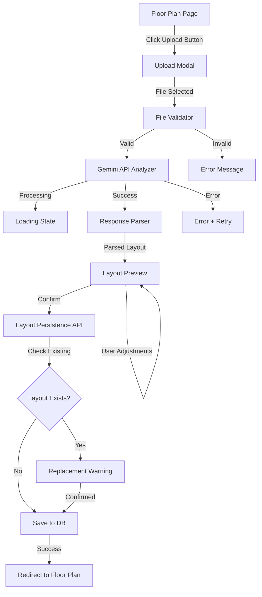
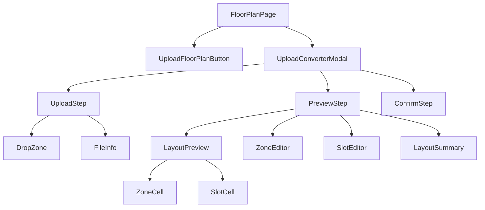

# Design Document: Floor Plan Upload Converter

## Overview

The Floor Plan Upload Converter adds the ability for authorized users (QC/Admin) to upload an image or PDF of a physical warehouse floor plan and have it automatically converted into the interactive web-based floor plan used by AromaSys. The feature leverages the existing Gemini API integration (already used in the Data Ingestion module) to analyze uploaded documents, extract zone layouts and slot positions, and produce a structured layout that integrates with the existing `slots` table in PostgreSQL.

The converter is accessed from the existing Interactive Floor Plan page (`/digital-twin/floor-plan`) via an "Upload Floor Plan" button visible only to QC/Admin users. It opens a modal workflow with three steps: Upload → Preview & Adjust → Confirm & Save.

## Architecture



### Integration Points

1. **Gemini API** — Reuses the same `gemini-2.5-flash` model and API key (`NEXT_PUBLIC_GEMINI_API_KEY`) already used in `/copilot/upload`. The prompt is adapted for floor plan analysis instead of inventory OCR.
2. **Slots API** (`/api/slots`) — Existing GET endpoint for reading slots. A new POST/PUT endpoint handles bulk slot creation/replacement.
3. **Auth Context** (`useAuth`) — Existing `canEdit()` function gates access to the upload feature (QC/Admin only).
4. **Floor Plan Page** — The upload button is added to the existing page header, and the modal renders inline within the page component.

## Components and Interfaces

### Component Hierarchy



### Key Interfaces

```typescript
// Floor Plan Layout structure returned by Gemini parser
interface FloorPlanLayout {
  gridDimensions: { rows: number; cols: number };
  zones: Zone[];
  slots: Slot[];
}

interface Zone {
  id: string;           // e.g., "A", "B", "C", "D", "E"
  name: string;         // e.g., "Cold Storage", "Loading Dock"
  type: ZoneType;
  gridArea: {           // CSS grid positioning
    rowStart: number;
    rowEnd: number;
    colStart: number;
    colEnd: number;
  };
}

type ZoneType = 'cold-storage' | 'hazardous' | 'general' | 'empty' | 'loading-dock';

interface Slot {
  id: string;           // Format: "{row_letter}-{column_number}" e.g., "A-1"
  zone: string;         // Zone ID this slot belongs to
  row: string;          // Row letter (A-E)
  col: number;          // Column number (1-6)
  label: string;        // Display label, same as id
}

// File validation result
interface FileValidationResult {
  valid: boolean;
  error?: string;       // Error message if invalid
  file?: File;          // The validated file
}

// API response from Gemini after parsing
interface GeminiFloorPlanResponse {
  zones: Array<{
    id: string;
    name: string;
    type: string;
    position: { rowStart: number; rowEnd: number; colStart: number; colEnd: number };
  }>;
  slots: Array<{
    id: string;
    zone: string;
    row: string;
    col: number;
  }>;
  gridSize: { rows: number; cols: number };
}

// Layout persistence payload
interface SaveLayoutPayload {
  layout: FloorPlanLayout;
  replaceExisting: boolean;
  user: { name: string; role: string };
}
```

### New API Route: `/api/floor-plan-layout`

| Method | Purpose | Request Body | Response |
|--------|---------|--------------|----------|
| GET | Check if layout exists | — | `{ exists: boolean, slotCount: number }` |
| POST | Save new layout (replace all slots) | `SaveLayoutPayload` | `{ success: boolean }` |

The POST endpoint performs a transaction:
1. If `replaceExisting` is true, delete all existing slots (preserving inventory items for matching slot IDs)
2. Insert new slot rows into the `slots` table
3. Re-link preserved inventory items to their matching slots
4. Log the action to `audit_logs`

## Data Models

### Existing `slots` Table (unchanged)

| Column | Type | Description |
|--------|------|-------------|
| id | VARCHAR(50) PK | Slot ID, format `{letter}-{number}` |
| zone | VARCHAR(50) | Zone letter (A-E) |
| row | CHAR(1) | Row letter |
| col | INTEGER | Column number |
| occupied | BOOLEAN | Whether slot has an item |
| item_id | VARCHAR(50) FK | Reference to inventory.id |

### Gemini API Prompt Structure

The prompt sent to Gemini for floor plan analysis:

```
You are an expert warehouse floor plan analyzer for the AromaSys system.
Analyze this floor plan image/document and extract the layout structure.

Return ONLY a valid JSON object (no markdown, no explanation) with this structure:
{
  "gridSize": { "rows": <number>, "cols": <number> },
  "zones": [
    {
      "id": "<letter A-E>",
      "name": "<zone name>",
      "type": "<cold-storage|hazardous|general|empty|loading-dock>",
      "position": { "rowStart": <n>, "rowEnd": <n>, "colStart": <n>, "colEnd": <n> }
    }
  ],
  "slots": [
    { "id": "<letter>-<number>", "zone": "<zone letter>", "row": "<letter>", "col": <number> }
  ]
}

Zone types must be one of: cold-storage, hazardous, general, empty, loading-dock.
Slot IDs must follow the format: single uppercase letter, dash, number (e.g., A-1, B-2).
Maximum 5 zones (A through E), maximum 6 columns per zone.
```

### File Validation Rules

| Rule | Constraint |
|------|-----------|
| Supported formats | `image/jpeg`, `image/png`, `application/pdf` |
| Maximum file size | 10 MB (10,485,760 bytes) |
| Minimum file size | 1 KB (to reject empty files) |

## Correctness Properties

*A property is a characteristic or behavior that should hold true across all valid executions of a system—essentially, a formal statement about what the system should do. Properties serve as the bridge between human-readable specifications and machine-verifiable correctness guarantees.*

### Property 1: File validation correctly accepts and rejects files

*For any* file metadata (MIME type and size), the file validation function SHALL accept the file if and only if the MIME type is one of `image/jpeg`, `image/png`, or `application/pdf` AND the file size is between 1 KB and 10 MB inclusive.

**Validates: Requirements 1.1, 1.2, 1.3**

### Property 2: Gemini response parsing produces valid layout

*For any* valid JSON string conforming to the GeminiFloorPlanResponse schema, the parser SHALL produce a FloorPlanLayout object where the number of zones equals the input zones count and the number of slots equals the input slots count, with all zone types being valid ZoneType values.

**Validates: Requirements 2.4**

### Property 3: Malformed responses are handled gracefully

*For any* string that is not valid JSON or does not conform to the GeminiFloorPlanResponse schema, the parser SHALL return an error result (never throw an unhandled exception) and the error result SHALL contain a descriptive message.

**Validates: Requirements 2.5**

### Property 4: Zone type to color mapping is consistent

*For any* valid ZoneType value, the color mapping function SHALL return the correct color pair (fill and border) as defined in the design system: cold-storage → (`#D6EAF8`, `#2980B9`), hazardous → (`#FADBD8`, `#E74C3C`), general → (`#D5F5E3`, `#27AE60`), empty → (`#F2F3F4`, `#BDC3C7`), loading-dock → (`#FEF9E7`, `#F39C12`).

**Validates: Requirements 3.2**

### Property 5: Slot IDs follow the correct format

*For any* slot generated by the layout system, the slot ID SHALL match the regex pattern `^[A-E]-[1-6]$` and SHALL equal the concatenation of the slot's row letter, a dash, and the slot's column number.

**Validates: Requirements 3.3, 5.1**

### Property 6: Layout to database transformation preserves all slots with valid data

*For any* valid FloorPlanLayout, the transformation to database rows SHALL produce exactly one row per slot, where each row has a valid zone (A-E), a row character matching the first character of the slot ID, a col integer matching the number portion of the slot ID, and occupied set to false for new slots.

**Validates: Requirements 4.2, 5.2, 3.8**

### Property 7: Inventory items are preserved for matching slots during layout replacement

*For any* existing layout with occupied slots and a new layout that contains some of the same slot IDs, after replacement, all inventory items whose slot ID exists in both the old and new layout SHALL remain linked to their slot (occupied = true, item_id preserved).

**Validates: Requirements 5.4**

### Property 8: Authorization restricts access to QC and Admin roles only

*For any* user role string, the authorization function SHALL return true if and only if the role is exactly "QC" or "Admin".

**Validates: Requirements 6.1**

## Error Handling

| Scenario | Handling | User Feedback |
|----------|----------|---------------|
| File too large (> 10 MB) | Reject before upload | Toast error: "File terlalu besar. Maksimal 10 MB." |
| Unsupported file format | Reject before upload | Toast error: "Format tidak didukung. Gunakan JPG, PNG, atau PDF." |
| Gemini API network error | Catch fetch error | Error card with retry button: "Gagal menghubungi AI. Coba lagi?" |
| Gemini returns unparseable response | JSON.parse in try/catch | Error card with retry button: "AI tidak dapat menganalisis gambar ini." |
| Gemini returns empty layout | Check zones.length === 0 | Info card: "Tidak ada struktur denah terdeteksi. Coba upload gambar yang lebih jelas." |
| Database save failure | Transaction rollback | Toast error: "Gagal menyimpan layout. Silakan coba lagi." |
| Unauthorized access attempt | Check role before rendering | Button hidden; API returns 403 |
| Duplicate slot IDs in AI response | Deduplicate by ID, keep first | Silent deduplication, show final count in summary |

## Testing Strategy

### Unit Tests (Example-Based)

- Upload modal renders correctly with drag-and-drop zone and file picker
- Loading indicator appears during Gemini API processing
- Gemini prompt contains all required extraction instructions
- Zone editor dropdown appears on zone click
- Slot label editor appears on slot click
- Add/remove zone buttons function correctly
- Success notification and redirect after save
- Replacement warning dialog when layout exists
- Saving indicator and disabled button during save
- Upload button hidden for Operator/PPIC roles
- API returns 403 for unauthorized users

### Property-Based Tests

Property-based testing is appropriate for this feature because it contains several pure functions with clear input/output behavior (file validation, response parsing, color mapping, ID formatting, layout transformation, authorization).

**Library:** `fast-check` (JavaScript property-based testing library)

**Configuration:** Minimum 100 iterations per property test.

Each property test references its design document property:
- **Feature: floor-plan-upload-converter, Property 1: File validation correctly accepts and rejects files**
- **Feature: floor-plan-upload-converter, Property 2: Gemini response parsing produces valid layout**
- **Feature: floor-plan-upload-converter, Property 3: Malformed responses are handled gracefully**
- **Feature: floor-plan-upload-converter, Property 4: Zone type to color mapping is consistent**
- **Feature: floor-plan-upload-converter, Property 5: Slot IDs follow the correct format**
- **Feature: floor-plan-upload-converter, Property 6: Layout to database transformation preserves all slots**
- **Feature: floor-plan-upload-converter, Property 7: Inventory items preserved for matching slots**
- **Feature: floor-plan-upload-converter, Property 8: Authorization restricts access to QC and Admin only**

### Integration Tests

- End-to-end upload flow: file → Gemini mock → preview → confirm → database
- Verify saved slots are loadable by existing `/api/slots` GET endpoint
- Verify floor plan page renders correctly with newly saved layout
- Verify inventory items survive layout replacement for matching slots
